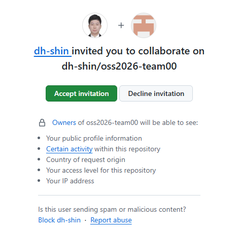

# C1. 초대 수락하고 이슈 만들기 — C

C 는 팀 저장소가 이미 만들어지고 규칙도 걸린 상태에서 들어옵니다. 새로 팀에 합류하는 사람과 같은 상황입니다. 먼저 저장소에 들어가 지금까지 무슨 일이 있었는지 기록으로 보고, 내가 할 일을 이슈로 적습니다.

C 가 하는 C1 ~ [C4](C4_conflict.md) 는 A·B 가 [P2](P2_first_pr.md) ~ [P4](P4_issue.md) 에서 나눠 한 일을 혼자 한 바퀴 도는 것입니다.

| | 하는 일 | A·B 쪽 대응 |
|---|---|---|
| C1 | 초대 수락, clone, 내 할 일을 이슈로 | [P0](P0_setup.md), [P4](P4_issue.md) 의 이슈 |
| [C2](C2_my_pr.md) | 내 PR 올리기 (`Closes #이슈`) | [P2](P2_first_pr.md), [P4](P4_issue.md) 의 PR |
| [C3](C3_review.md) | 팀원 PR 리뷰·승인·머지 | [P2](P2_first_pr.md) 의 리뷰 |
| [C4](C4_conflict.md) | 내 PR 의 충돌 풀고 머지 → 이슈가 닫힘 | [P3](P3_conflict.md), [P4](P4_issue.md) |

혼자 하는 문제라 막히면 [부록: 흔한 오류](../README.md#부록-흔한-오류)를 먼저 봅니다. 그래도 안 되면 팀원에게 묻습니다.

## 초대 수락 (브라우저)

1. GitHub 에 등록한 메일에서 A 가 보낸 초대 메일의 **View invitation** 을 누르거나, 주소창에 직접 엽니다. `<A의 ID>` 와 `NN` 은 팀원에게 확인합니다.
   ```
   https://github.com/<A의 ID>/oss2026-teamNN/invitations
   ```
2. **Accept invitation**. 저장소 페이지가 열리면 됩니다. 이제 C 도 이 저장소에 push 하고, PR 을 리뷰·승인·머지할 수 있습니다.

   

   `404` 가 나오거나 초대가 없다고 나오면 A 가 아직 초대하지 않았거나 아이디를 잘못 넣은 것입니다. A 에게 [P0](P0_setup.md) 의 10 ~ 11번을 부탁합니다.

## clone 하고 히스토리 보기 (터미널)

3. 실습 폴더로 가서 clone 합니다. 주소는 저장소 페이지의 초록색 **Code** 버튼 → HTTPS 에 있는 것을 복사합니다.
   ```
   git clone https://github.com/<A의 ID>/oss2026-teamNN.git
   cd oss2026-teamNN
   ```
4. 지금까지의 히스토리를 봅니다.
   ```
   git log --oneline --graph
   ```
   위에서부터 `Merge pull request #… from …` 이 여러 개 보입니다. 하나하나가 팀원의 PR 이 머지된 기록입니다. 중간에 `Merge remote-tracking branch 'origin/main' into row-…` 이 있으면 [P3](P3_conflict.md) 에서 팀원이 충돌을 푼 흔적입니다. 맨 아래는 `docs: team table`, `Initial commit` 입니다.
5. **확인**: `ls -a` 에 `README.md`, `.gitignore`, `.editorconfig` 가 보이고, `cat README.md` 의 팀원 표에 A·B 두 줄이 있으면 됩니다. 팀원이 아직 [P2](P2_first_pr.md) ~ [P3](P3_conflict.md) 을 끝내지 않았다면 파일이나 줄이 덜 보일 수 있습니다. 그때는 끝난 뒤에 `git pull` 로 받습니다.

## 내 할 일을 이슈로 (브라우저)

6. 저장소 위쪽 **Issues** 탭 → 초록색 **New issue**.
7. **Add a title**: `팀원 표에 <내 ID> 추가`
8. **Add a description**: 할 일을 한두 줄로 적습니다.
   ```
   README 팀원 표에 내 줄을 넣고, 팀 프로젝트에서 맡을 일을 적는다.
   ```
9. 오른쪽 **Assignees** 의 톱니바퀴 → **나**를 고릅니다(목록 맨 위의 `assign yourself` 를 눌러도 됩니다). **Labels** 의 톱니바퀴 → `documentation`.
10. **Create**. 제목 옆의 `#번호` 를 적어 둡니다. [C2](C2_my_pr.md) 에서 씁니다.

---

[← 문제 목록](../README.md#문제) · [이전: P5](P5_for_c.md) · [다음: C2](C2_my_pr.md) · [부록: 흔한 오류](../README.md#부록-흔한-오류)
