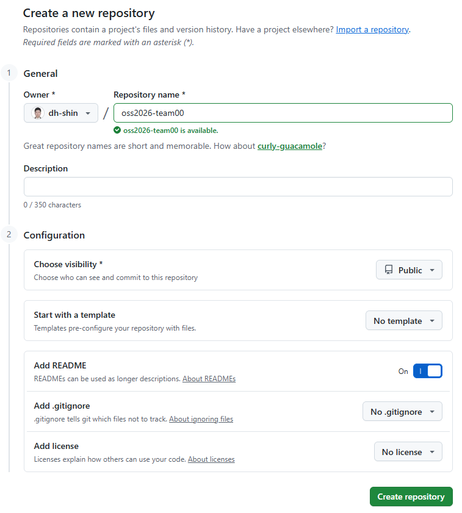

# P0. 팀 저장소 만들기 — A, B — `docs: team table`

지금까지는 저장소를 혼자 만들고 혼자 push 했습니다. 오늘은 A 의 계정에 저장소를 하나 만들고, B 와 C 를 협업자(collaborator)로 초대합니다. 초대를 수락한 사람은 주인(owner)과 똑같이 push 할 수 있게 됩니다.

이 문제에서 하는 것:
- A: GitHub 에 팀 저장소 만들기 → README 에 팀원 표 틀 넣기 → B·C 초대
- B: 초대 수락
- A·B: 각자 clone

끝나면 세 사람이 같은 저장소를 각자 노트북에 갖게 됩니다. 이 문제의 README 수정은 main 에 직접 하는 **마지막 커밋**입니다. [P1](P1_ruleset.md) 에서 규칙을 걸면 그 뒤로는 PR 로만 바꿀 수 있습니다.

## A: 저장소 만들기 (브라우저)

1. github.com 에 로그인한 뒤 오른쪽 위 **+** → **New repository**.
2. **Repository name** 에 `oss2026-teamNN` 을 정확히 입력합니다. `NN` 은 두 자리 조 번호입니다(3조 → `oss2026-team03`). 확인 스크립트가 이 이름을 찾습니다.
3. **Choose visibility** 가 **Public** 인지 확인합니다.
4. **Add README** 를 **On** 으로 켭니다. (지난주와 반대입니다. 이번에는 로컬에 먼저 만든 저장소가 없고, 모두 GitHub 에서 clone 해서 시작하므로 README 가 있는 편이 낫습니다.) 나머지는 기본값 그대로.
5. 맨 아래 **Create repository**. README 하나가 있는 저장소 페이지가 열립니다.

   

## A: README 에 팀원 표 틀 넣기 (브라우저, 웹 편집기)

6. 파일 목록에서 `README.md` 를 누르고, 오른쪽 위 연필 아이콘(**Edit this file**)을 누릅니다.
7. 내용을 전부 지우고 아래로 바꿉니다. 첫 줄의 `NN` 은 우리 조 번호로 바꿉니다. 표는 머리글 두 줄만 둡니다. 팀원 줄은 [P3](P3_conflict.md) 와 [C2](C2_my_pr.md) 에서 각자 PR 로 넣습니다.
   ```
   # oss2026-teamNN

   ## 팀원

   | GitHub | 맡은 일 |
   |---|---|
   ```
8. 오른쪽 위 **Commit changes...** → Commit message 에 `docs: team table` → **Commit directly to the main branch** 가 선택된 상태로 **Commit changes**.
9. 저장소 페이지의 README 에 "팀원" 제목과 빈 표 머리글(`GitHub | 맡은 일`)이 보이면 됩니다.

## A: B·C 초대 (브라우저)

10. 저장소 위쪽 탭에서 **Settings** → 왼쪽 메뉴 **Collaborators** 를 엽니다. 비밀번호나 인증을 다시 물으면 입력합니다.
11. **Add people** → 검색 칸(`Search by username, full name, or email`)에 B 의 GitHub 아이디를 입력 → 아래 목록에서 B 를 고르고 → 초록색 **Add <B의 ID>**. 같은 방법으로 C 도 초대합니다. **C 가 오늘 오지 않았어도 지금 초대합니다.** C 는 나중에 혼자 수락합니다.
12. 목록에 B·C 가 **Pending Invite** 로 보이면 됩니다. 아직 권한이 생긴 건 아니고, 각자 수락해야 생깁니다.

## B: 초대 수락 (브라우저)

13. B 는 GitHub 에 등록한 메일의 초대 메일에서 **View invitation**, 또는 주소창에 아래를 직접 엽니다.
    ```
    https://github.com/<A의 ID>/oss2026-teamNN/invitations
    ```
14. **Accept invitation**. 저장소 페이지가 열리면 됩니다.

    

    A 의 Collaborators 화면에서는 B 의 Pending Invite 가 사라집니다.

## A·B: 각자 clone (터미널)

15. 각자 실습 폴더로 가서 clone 합니다. 주소는 저장소 페이지의 초록색 **Code** 버튼 → HTTPS 에 있는 것을 복사합니다. B 도 **A 의 저장소 주소**를 씁니다.
    ```
    git clone https://github.com/<A의 ID>/oss2026-teamNN.git
    cd oss2026-teamNN
    ```
16. **확인**: `git log --oneline` 에 두 줄이 보입니다. 아래가 GitHub 이 만든 `Initial commit`, 위가 8번의 `docs: team table` 입니다. `cat README.md` 로 표 머리글이 보이면 됩니다.
    ```
    a1b2c3d (HEAD -> main, origin/main, origin/HEAD) docs: team table
    e4f5a6b Initial commit
    ```

---

[← 문제 목록](../README.md#문제) · [다음: P1](P1_ruleset.md) · [부록: 흔한 오류](../README.md#부록-흔한-오류)
