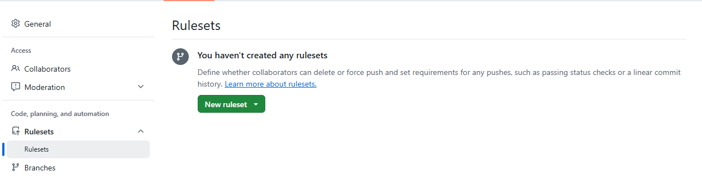
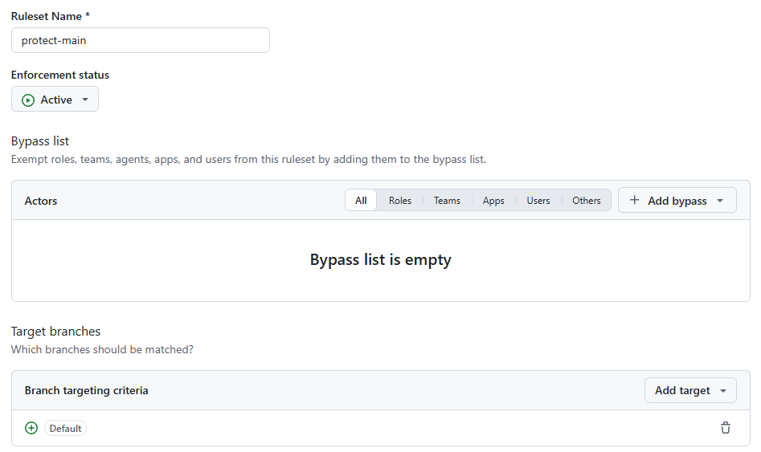
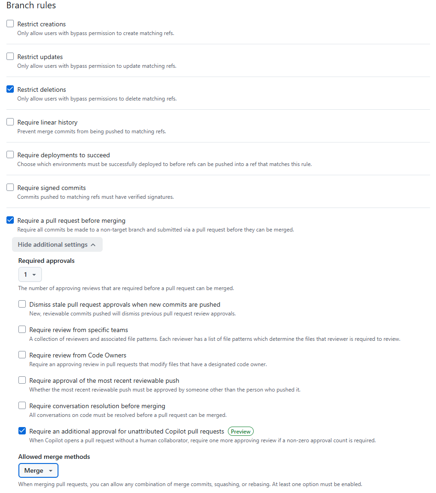

# P1. main 보호하기 — A(설정), B(확인) — ruleset `protect-main`

지금은 초대받은 사람 누구나 `git push origin main` 으로 main 을 바로 바꿀 수 있습니다. "main 에 직접 커밋하지 않는다" 는 말로만 정하면 급할 때 깨집니다. **ruleset** 을 걸면 GitHub 이 이 규칙을 대신 지켜 줍니다. main 에 직접 push 하면 거부되고, PR 은 팀원 한 명이 승인해야 머지됩니다.

이 문제에서 하는 것:
- A: main 에 ruleset 만들기 (브라우저)
- B: main 에 직접 push 해 보고 거부되는 것 확인 → 로컬을 원래대로 (터미널)

ruleset 설정은 주인(A)만 할 수 있습니다. B 는 A 가 설정하는 화면을 옆에서 같이 봅니다.

## A: ruleset 만들기 (브라우저)

1. 저장소 **Settings** → 왼쪽 메뉴 **Code, planning, and automation** 아래 **Rulesets**.

   
2. **New ruleset** → **New branch ruleset**.
3. 위쪽 칸을 채웁니다.
   - **Ruleset Name**: `protect-main`
   - **Enforcement status**: **Active** 로 바꿉니다. 기본값 Disabled 로 두면 만들어지기만 하고 아무것도 막지 않습니다.
   - **Bypass list**: 비워 둡니다. 여기에 사람을 넣으면 그 사람은 규칙을 건너뛸 수 있습니다. 주인 A 도 넣지 않습니다.
   - **Target branches**: **Add target** → **Include default branch**. 목록에 `Default` 가 생기면 됩니다. 기본 브랜치, 즉 `main` 입니다.

   
4. 아래로 내려 **Rules** 를 고릅니다.
   - **Restrict deletions**(위쪽)와 **Block force pushes**(아래쪽): 이미 체크되어 있습니다. 그대로 둡니다. main 을 지우거나 강제 push 로 기록을 덮어쓰는 것을 막습니다.
   - **Require a pull request before merging** 을 체크합니다. 아래에 설정이 펼쳐집니다.
     - **Required approvals**: `1` 로 바꿉니다. 작성자가 아닌 사람 한 명이 승인해야 머지할 수 있다는 뜻입니다. 2 로 하면 한 사람이 빠졌을 때 아무것도 머지할 수 없습니다.
     - **Allowed merge methods**: **Merge** 만 남기고 **Squash**, **Rebase** 는 뺍니다. PR 이 머지될 때마다 머지 커밋이 하나씩 남아 누가 언제 무엇을 합쳤는지 기록에 보입니다.
     - 나머지 체크박스는 건드리지 않습니다. (`Require an additional approval for unattributed Copilot pull requests` 처럼 이미 체크된 것도 그대로 둡니다.)

   
5. 맨 아래 **Create**. Rulesets 목록에 `protect-main` 이 **Active** 로 보이면 됩니다.

## B: main 에 직접 push 해 보기 (터미널)

규칙이 걸렸는지는 막혀 보면 압니다.

6. B 의 clone 에서 main 에 있는지 확인합니다. `git status` 첫 줄이 `On branch main` 이어야 합니다.
7. VS Code 에서 `README.md` 맨 아래에 아무 줄이나 하나 추가하고 저장한 뒤 커밋합니다.
   ```
   git commit -am "test: direct push"
   ```
8. push 합니다.
   ```
   git push
   ```
   아래처럼 거부되면 규칙이 제대로 걸린 것입니다. `Changes must be made through a pull request` 가 이유입니다.
   ```
   remote: error: GH013: Repository rule violations found for refs/heads/main.
   remote: Review all repository rules at https://github.com/<A의 ID>/oss2026-teamNN/rules?ref=refs%2Fheads%2Fmain
   remote:
   remote: - Changes must be made through a pull request.
   remote:
   To https://github.com/<A의 ID>/oss2026-teamNN.git
    ! [remote rejected] main -> main (push declined due to repository rule violations)
   error: failed to push some refs to 'https://github.com/<A의 ID>/oss2026-teamNN.git'
   ```
   주인 A 가 push 해도 똑같이 거부됩니다. Bypass list 를 비워 두었기 때문입니다.
   거부되지 않고 올라가 버렸다면 A 의 3번 Enforcement status 나 4번 Require a pull request 가 빠진 것입니다. A 에게 알리고 ruleset 을 고친 뒤 다시 확인합니다. (이미 올라간 커밋은 그대로 둡니다.)
9. 7번 커밋은 GitHub 에 올라가지 않았고 B 의 로컬에만 있습니다. 로컬 main 을 GitHub 의 main 과 똑같이 되돌립니다. 지난주의 `reset --hard` 입니다. push 하지 않은 내 커밋이라 지워도 괜찮습니다.
   ```
   git reset --hard origin/main
   ```
   `HEAD is now at … docs: team table` 이 나오면 됩니다.
10. **확인**: `git log --oneline -1` 의 맨 윗줄이 `docs: team table` 이고, `git status` 가 `Your branch is up to date with 'origin/main'` 이면 됩니다.

이제 main 을 바꾸는 길은 PR 하나뿐입니다. [P2](P2_first_pr.md) 부터 그 길로 갑니다.

---

[← 문제 목록](../README.md#문제) · [이전: P0](P0_setup.md) · [다음: P2](P2_first_pr.md) · [부록: 흔한 오류](../README.md#부록-흔한-오류)
