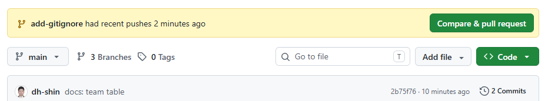
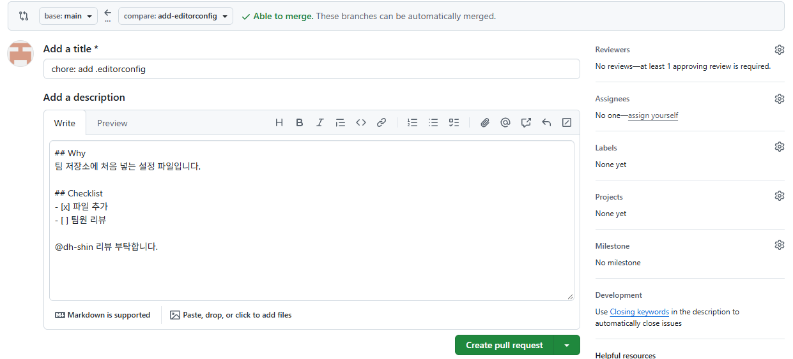
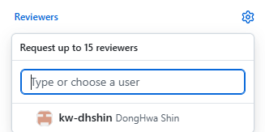
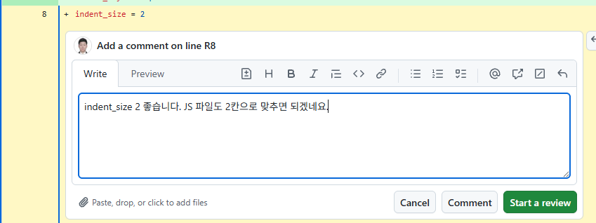
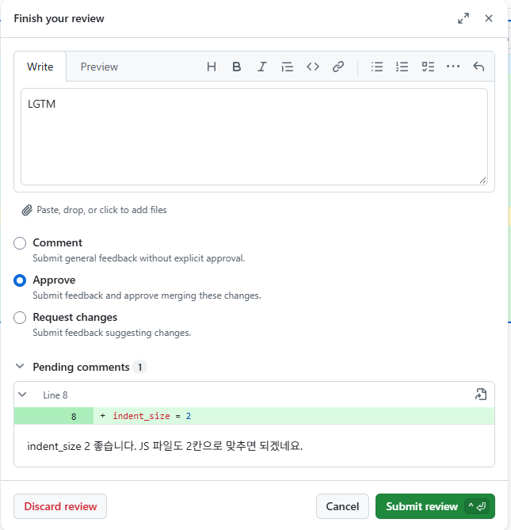
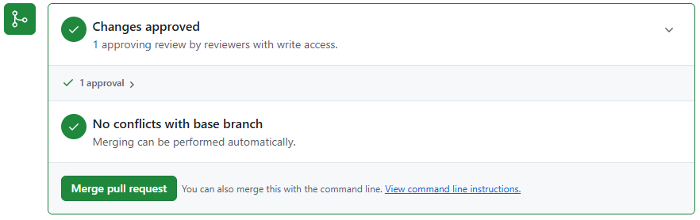

# P2. 첫 PR 과 리뷰 — A, B — `chore: add .gitignore`(A) · `chore: add .editorconfig`(B)

팀 저장소에 처음 넣을 설정 파일 두 개를 A 와 B 가 하나씩 PR 로 올립니다. 그리고 서로의 PR 을 리뷰하고 승인합니다. 이번 주의 기본 흐름(team loop)을 처음부터 끝까지 한 번 도는 문제입니다.

```
브랜치 → 커밋 → push → PR 열기 → 팀원 리뷰·승인 → 머지 → 내 main 갱신
```

| | A | B |
|---|---|---|
| 브랜치 | `add-gitignore` | `add-editorconfig` |
| 파일 | `.gitignore` | `.editorconfig` |
| 커밋 메시지 | `chore: add .gitignore` | `chore: add .editorconfig` |
| 리뷰할 PR | B 의 PR | A 의 PR |

두 사람이 **동시에** 진행합니다. 서로 다른 파일을 만들기 때문에 순서가 엉켜도 충돌은 나지 않습니다. 아래 단계에서 `<브랜치>`, `<파일>` 은 위 표에서 내 칸을 씁니다.

## 브랜치에서 커밋하고 push (터미널, VS Code)

1. main 이 최신인지 확인하고 받아 둡니다.
   ```
   git checkout main
   git pull
   ```
2. 새 브랜치를 만들고 그리로 옮깁니다.
   ```
   git checkout -b <브랜치>
   ```
   `Switched to a new branch '<브랜치>'` 가 나오면 됩니다.
3. VS Code 에서 저장소 맨 위(README.md 옆)에 새 파일을 만들고 내용을 적어 저장합니다.

   A — `.gitignore`
   ```
   node_modules/
   .env
   .DS_Store
   ```
   `node_modules/` 는 `npm install` 이 만드는 폴더(다시 설치하면 생김), `.env` 는 API 키 같은 비밀값을 두는 파일입니다. 둘 다 저장소에 올리지 않습니다.

   B — `.editorconfig`
   ```
   # EditorConfig: https://editorconfig.org
   root = true

   [*]
   charset = utf-8
   end_of_line = lf
   indent_style = space
   indent_size = 2
   insert_final_newline = true
   trim_trailing_whitespace = true

   [*.md]
   trim_trailing_whitespace = false
   ```
   세 사람의 에디터가 같은 들여쓰기·줄 끝 설정을 쓰게 하는 파일입니다. VS Code 에서는 확장 **EditorConfig for VS Code** 를 설치해야 이 파일을 읽습니다.
4. 커밋합니다. 새 파일이라 `-a` 로는 안 들어가니 `add` 를 먼저 합니다.
   ```
   git add <파일>
   git commit -m "<커밋 메시지>"
   ```
5. 브랜치를 GitHub 에 올립니다. 이 브랜치는 처음 올리는 것이라 `-u origin <브랜치>` 를 붙입니다.
   ```
   git push -u origin <브랜치>
   ```
   출력 중간에 `Create a pull request for '<브랜치>' on GitHub by visiting:` 과 주소가 보이면 됩니다. GitHub 이 PR 을 열 주소를 알려 주는 것입니다.

## PR 열기 (브라우저)

6. 저장소 페이지를 새로 고치면 위쪽에 노란 띠 **`<브랜치>` had recent pushes** 와 초록색 **Compare & pull request** 버튼이 보입니다. 누릅니다. 이 띠는 방금 push 한 사람에게만 보입니다. (띠가 없으면 **Pull requests** 탭 → **New pull request** → compare 에서 내 브랜치를 고릅니다.)

   
7. 맨 위 화살표 줄을 확인합니다. **base: main ← compare: `<브랜치>`** 여야 합니다. "내 브랜치의 변경을 main 으로 보낸다" 는 뜻입니다.
8. 제목은 커밋 메시지가 자동으로 들어가 있습니다. 그대로 둡니다. 설명(**Add a description**)에는 아래처럼 Markdown 으로 적습니다. `<ID>` 는 리뷰해 줄 팀원의 GitHub 아이디입니다.
   ```
   ## Why
   팀 저장소에 처음 넣는 설정 파일입니다.

   ## Checklist
   - [x] 파일 추가
   - [ ] 팀원 리뷰

   @<ID> 리뷰 부탁합니다.
   ```
   체크박스 줄에서 Enter 를 치면 GitHub 이 다음 줄에 `- [ ] ` 를 저절로 넣어 줍니다. 그 뒤에 글자만 이어서 칩니다(`- [ ]` 를 또 치면 두 번 들어갑니다). 목록을 끝내려면 빈 `- [ ] ` 줄에서 Enter 를 한 번 더 칩니다. `@` 를 치면 아이디 목록이 뜨는데, 끝까지 직접 쳐도 되고 목록에서 골라도 됩니다.
   **Preview** 탭을 눌러 제목·체크박스·`@아이디` 링크가 제대로 보이는지 확인합니다.

   
9. 오른쪽 **Reviewers** 의 톱니바퀴 → 팀원 아이디를 고릅니다. 목록 밖을 누르면 닫히고, Reviewers 아래에 팀원 아이디가 보입니다.

   
10. **Create pull request**. PR 번호(`#1` 등)가 붙은 페이지가 열립니다. 아래쪽 머지 상자에 빨간 **Review required** 와 회색 **Merge pull request** 버튼이 보입니다. 승인 전이라 머지할 수 없다는 뜻입니다.

## 팀원의 PR 리뷰하기 (브라우저)

11. 팀원의 PR 을 엽니다. 알림(오른쪽 위 종 모양)이나 **Pull requests** 탭에서 찾습니다.
12. **Files changed** 탭을 엽니다. 추가된 줄이 초록색으로 보입니다. 줄 위에 마우스를 올리면 줄 번호 옆에 파란 **+** 가 나옵니다. 눌러서 한 줄에 댓글을 남겨 봅니다(예: `.env 는 왜 빼나요?`, `indent_size 2 좋습니다`). 댓글 칸을 **먼저 클릭한 뒤** 칩니다. 아래 버튼이 둘인데 **Start a review** 를 누릅니다. (**Comment** 는 댓글 하나를 바로 올립니다.) 아직 작성자에게 보이지 않는 대기(pending) 상태가 됩니다.

    
13. 오른쪽 위 초록색 **Submit review**(또는 **Review changes**) → 요약 한 줄(예: `LGTM`) → **Approve** 를 고르고 → **Submit review**. 12번에서 남긴 줄 댓글이 아래 **Pending comments** 에 같이 보이고, 이때 한꺼번에 올라갑니다.

    

## 내 PR 머지하고 정리 (브라우저 → 터미널)

14. 내 PR 페이지로 돌아갑니다. 팀원이 승인하면 머지 상자가 초록 **Changes approved** 로 바뀌고 **Merge pull request** 버튼이 열립니다. 누르고 → **Confirm merge**.

    
15. 보라색 **Merged** 표시와 함께 **Delete branch** 버튼이 나옵니다. 누릅니다. GitHub 의 브랜치만 지워지고, 커밋은 main 에 남습니다.
16. 터미널에서 main 으로 돌아와 받아 오고, 다 쓴 로컬 브랜치를 지웁니다.
    ```
    git checkout main
    git pull
    git branch -d <브랜치>
    ```
17. **확인**: 두 PR 이 모두 머지된 뒤 `git pull` 을 한 번 더 하고 `ls -a` 를 치면 `.gitignore` 와 `.editorconfig` 가 둘 다 보여야 합니다. `git log --oneline --graph` 에 `Merge pull request #… from <A의 ID>/add-gitignore`, `Merge pull request #… from <A의 ID>/add-editorconfig` 두 머지 커밋이 보이면 됩니다. (`from` 뒤는 PR 을 만든 사람이 아니라 저장소 주인 A 의 아이디입니다.) GitHub 의 **Pull requests** 탭 → **Closed** 에 두 PR 이 보라색 Merged 로 있습니다.

---

[← 문제 목록](../README.md#문제) · [이전: P1](P1_ruleset.md) · [다음: P3](P3_conflict.md) · [부록: 흔한 오류](../README.md#부록-흔한-오류)
