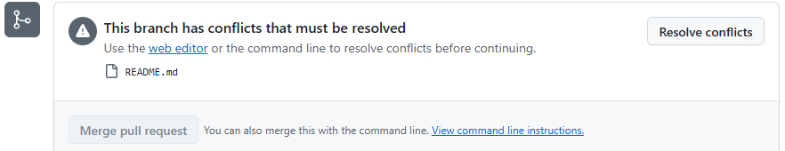

# P3. PR 충돌 풀기 — A, B — `docs: add <ID> to team table`

[P2](P2_first_pr.md) 에서는 두 사람이 서로 다른 파일을 바꿔서 충돌이 없었습니다. 실제 팀 작업에서는 둘이 같은 파일의 같은 자리를 고치는 일이 자주 생깁니다. 먼저 머지된 PR 은 문제없지만, 나중 PR 에는 **This branch has conflicts that must be resolved** 가 뜨고 GitHub 이 머지를 막습니다.

이번에는 일부러 그 상황을 만듭니다. A 와 B 가 각자 README 팀원 표의 **같은 자리**(머리글 바로 아래)에 자기 줄을 넣습니다.

이 문제에서 하는 것:
- A·B: 각자 브랜치에서 표에 내 줄 추가 → PR → 서로 승인
- A: 먼저 머지
- B: 충돌난 PR 을 내 브랜치에서 해결 (`fetch` → `merge origin/main` → 해결 → 커밋 → push) → 머지

충돌 해결(9 ~ 15번)은 B 가 합니다. A 는 B 의 화면을 옆에서 같이 봅니다.

## A·B: 표에 내 줄 넣고 PR (터미널, VS Code, 브라우저)

1. main 을 최신으로 받고 브랜치를 만듭니다. 브랜치 이름에 내 GitHub 아이디를 넣어 두 사람의 브랜치 이름이 겹치지 않게 합니다.
   ```
   git checkout main
   git pull
   git checkout -b row-<내 ID>
   ```
2. VS Code 에서 `README.md` 를 열고, 표 머리글 `|---|---|` **바로 아래 줄**에 내 줄을 넣고 저장합니다. 맡은 일은 팀 프로젝트에서 맡고 싶은 일을 자유롭게 적습니다.
   ```
   | GitHub | 맡은 일 |
   |---|---|
   | @<내 ID> | 화면 구성 |
   ```
3. 커밋하고 브랜치를 올립니다.
   ```
   git commit -am "docs: add <내 ID> to team table"
   git push -u origin row-<내 ID>
   ```
4. 브라우저에서 PR 을 엽니다([P2](P2_first_pr.md) 의 6 ~ 10번과 같습니다). 설명은 한 줄이면 됩니다(`팀원 표에 제 줄을 추가합니다.`). Reviewers 에 팀원을 지정하고 **Create pull request**.
5. 서로의 PR 을 **Approve** 합니다([P2](P2_first_pr.md) 의 11 ~ 13번). 지금은 두 PR 다 머지 상자가 초록입니다. 둘 다 main 의 같은 상태에서 출발했고, 아직 아무것도 머지되지 않았기 때문입니다.

## A: 먼저 머지 (브라우저)

6. A 는 자기 PR 을 **Merge pull request** → **Confirm merge** → **Delete branch**.
7. 이제 main 의 표에는 A 의 줄이 들어 있습니다.

## B: 충돌 확인 (브라우저)

8. B 는 자기 PR 페이지를 새로 고칩니다. 머지 상자가 바뀌어 있습니다: **This branch has conflicts that must be resolved**, 그 아래 충돌 파일 `README.md`. A 의 줄과 B 의 줄이 같은 자리에 들어가려고 하기 때문입니다. Merge 버튼은 회색입니다.

   

   GitHub 화면의 **Resolve conflicts** 버튼으로도 풀 수 있지만, 오늘은 터미널에서 풉니다. 충돌은 팀 작업 내내 나오고, 터미널에서 푸는 방법은 어떤 경우에도 통합니다.

## B: 내 브랜치에서 충돌 풀기 (터미널, VS Code)

9. 내 브랜치에 있는지 확인합니다. `git status` 첫 줄이 `On branch row-<내 ID>` 여야 합니다. 아니면 `git checkout row-<내 ID>`.
10. GitHub 의 최신 상태를 받아옵니다. 받아오기만 하고 합치지는 않습니다.
    ```
    git fetch
    ```
11. **main 을 내 브랜치에 합칩니다.** 방향에 주의합니다. main 에 내 브랜치를 넣는 게 아니라(그건 PR 머지가 할 일), 내 브랜치에 main 의 새 커밋을 가져오는 것입니다.
    ```
    git merge origin/main
    ```
    `CONFLICT (content): Merge conflict in README.md` 가 나면 맞게 된 것입니다.
12. VS Code 에서 `README.md` 를 엽니다. 표 아래가 이렇게 되어 있습니다.
    ```
    |---|---|
    <<<<<<< HEAD
    | @<B의 ID> | 서버 |
    =======
    | @<A의 ID> | 화면 구성 |
    >>>>>>> origin/main
    ```
    위쪽(`HEAD`)이 내 브랜치, 아래쪽이 main(A 가 먼저 머지한 것)입니다. 이번에는 둘 중 하나를 고르는 게 아니라 **둘 다 남깁니다.** 마커 세 줄(`<<<<<<<`, `=======`, `>>>>>>>`)을 지우고, A 의 줄을 위로, 내 줄을 아래로 둡니다. 저장합니다.
    ```
    |---|---|
    | @<A의 ID> | 화면 구성 |
    | @<B의 ID> | 서버 |
    ```
13. 마커가 남지 않았는지 확인합니다. 아무것도 안 나와야 합니다.
    ```
    git grep -n -e "<<<<<<<" -e ">>>>>>>"
    ```
14. 해결을 알리고 머지 커밋을 만듭니다. 편집기가 `Merge remote-tracking branch 'origin/main' into row-<내 ID>` 메시지와 함께 열리면 그대로 저장하고 닫습니다.
    ```
    git add README.md
    git commit
    ```
15. 브랜치를 다시 올립니다. 이미 `-u` 로 연결된 브랜치라 그냥 `push` 면 됩니다.
    ```
    git push
    ```

## B: 머지 (브라우저)

16. PR 페이지를 새로 고칩니다. **Commits** 탭에 방금 만든 머지 커밋이 추가되어 있고, 머지 상자는 다시 초록입니다. 한동안 `Checking for the ability to merge automatically…` 만 보이면 1 ~ 2분 기다렸다가 F5 를 누릅니다. 같은 브랜치에 push 하면 PR 이 저절로 갱신됩니다. 5번의 승인도 그대로 남아 있습니다. 팀원에게 "충돌 풀었으니 Files changed 한 번 더 봐 달라" 고 말하고, 확인을 받으면 **Merge pull request** → **Confirm merge** → **Delete branch**.
17. A·B 모두 터미널에서 main 을 갱신하고 브랜치를 지웁니다.
    ```
    git checkout main
    git pull
    git branch -d row-<내 ID>
    ```
18. **확인**: GitHub 저장소 첫 화면의 README 표에 A·B 두 줄이 다 있고, 마커가 없어야 합니다. `git log --oneline --graph -8` 에서 B 의 브랜치 쪽에 `Merge remote-tracking branch 'origin/main' into row-…` 커밋이 보입니다. 이것이 충돌을 내 브랜치에서 푼 흔적입니다.

---

[← 문제 목록](../README.md#문제) · [이전: P2](P2_first_pr.md) · [다음: P4](P4_issue.md) · [부록: 흔한 오류](../README.md#부록-흔한-오류)
