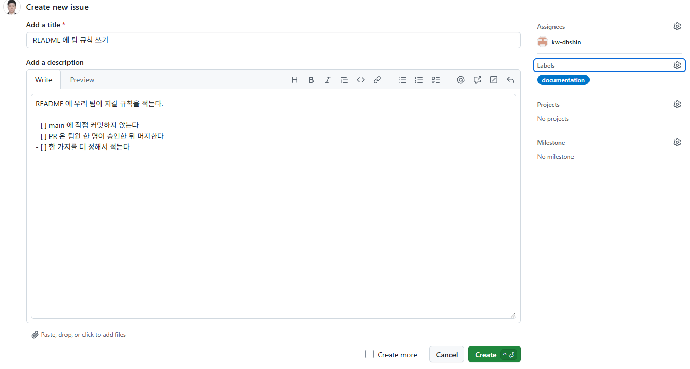
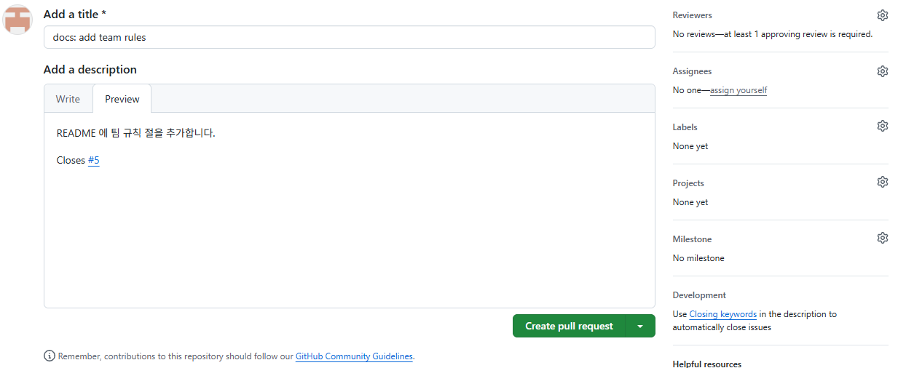
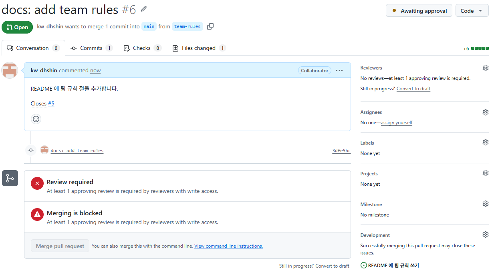

# P4. 이슈를 PR 로 닫기 — A(이슈), B(PR) — `docs: add team rules`

이슈(issue)는 할 일 한 건입니다. 버그 신고, 만들 기능, 정할 것. 팀 프로젝트에서는 할 일을 이슈로 적고, 담당자를 정하고, 그 일을 한 PR 이 머지될 때 이슈가 닫히게 합니다. PR 설명에 `Closes #번호` 를 적어 두면 머지되는 순간 GitHub 이 그 이슈를 자동으로 닫습니다.

이 문제에서 하는 것:
- A: 이슈 만들기, 담당자 B
- B: 그 일을 하는 PR, 설명에 `Closes #번호` → A 승인 → 머지
- 이슈가 저절로 닫혔는지 확인

## A: 이슈 만들기 (브라우저)

1. 저장소 위쪽 **Issues** 탭 → 초록색 **New issue**.
2. **Add a title**: `README 에 팀 규칙 쓰기`
3. **Add a description** 에 아래를 적습니다. 이슈 설명도 Markdown 입니다. 첫 `- [ ]` 줄 다음부터는 Enter 를 치면 `- [ ] ` 가 저절로 들어가니 글자만 이어서 칩니다([P2](P2_first_pr.md) 8번).
   ```
   README 에 우리 팀이 지킬 규칙을 적는다.

   - [ ] main 에 직접 커밋하지 않는다
   - [ ] PR 은 팀원 한 명이 승인한 뒤 머지한다
   - [ ] 한 가지를 더 정해서 적는다
   ```
4. 오른쪽 **Assignees** 의 톱니바퀴 → B 를 고릅니다. **Labels** 의 톱니바퀴 → `documentation` 을 고릅니다.

   

5. **Create**. 제목 옆에 `#번호` 가 붙습니다. **이 번호를 B 에게 알려 줍니다.** 이슈와 PR 은 번호를 같이 쓰므로, 앞의 PR 수에 따라 `#5` 나 `#6` 쯤이 됩니다.

## B: 그 일을 하는 PR (터미널, VS Code, 브라우저)

6. main 을 받고 브랜치를 만듭니다.
   ```
   git checkout main
   git pull
   git checkout -b team-rules
   ```
7. VS Code 에서 `README.md` **맨 아래**에 빈 줄 하나를 두고 규칙 절을 추가한 뒤 저장합니다. 표 바로 밑에 붙여 쓰면 제목이 표의 한 줄로 들어가 버립니다. 세 번째 규칙은 A 와 의논해서 정합니다(예: 커밋 메시지는 `feat:`, `fix:`, `docs:` 로 시작한다).
   ```
   ## 규칙

   - main 에 직접 커밋하지 않는다. 모든 변경은 PR 로.
   - PR 은 팀원 한 명이 승인한 뒤 머지한다.
   - 커밋 메시지는 `feat:`, `fix:`, `docs:`, `chore:` 로 시작한다.
   ```
8. 커밋하고 올립니다.
   ```
   git commit -am "docs: add team rules"
   git push -u origin team-rules
   ```
9. 브라우저에서 PR 을 엽니다. 설명 마지막 줄에 A 가 알려 준 이슈 번호로 `Closes #번호` 를 적습니다.
   ```
   README 에 팀 규칙 절을 추가합니다.

   Closes #5
   ```
   `#` 를 치면 이슈 목록이 뜹니다. 번호를 끝까지 치고 Esc 로 닫거나, 목록에서 그 이슈를 골라도 됩니다. **Preview** 에서 `#5` 가 링크로 보이면 번호를 제대로 적은 것입니다.

   

   Reviewers 에 A 를 지정하고 **Create pull request**.
10. PR 페이지를 한 번 새로 고치면(F5) 오른쪽 **Development** 칸에 이슈 제목이 연결되어 보입니다. GitHub 이 `Closes #5` 를 읽었다는 뜻입니다. 만든 직후에는 `None yet` 으로 보일 수 있습니다.

    

## A: 승인, B: 머지 (브라우저)

11. A 는 B 의 PR 을 **Files changed** 에서 보고 **Approve** 합니다.
12. B 는 **Merge pull request** → **Confirm merge** → **Delete branch**. 터미널에서 `git checkout main`, `git pull`, `git branch -d team-rules`.
13. **확인**: **Issues** 탭에서 이슈가 열린 목록(Open)에서 사라지고 **Closed** 에 있습니다. 이슈를 열어 보면 아무도 Close 버튼을 누르지 않았는데 보라색 **Closed** 이고, 아래 기록에 `closed this as completed in #6` 처럼 닫은 PR 번호가 남아 있습니다.

`Closes` 는 PR **설명**에 있어야 하고, PR 이 **main** 으로 머지될 때만 동작합니다. 댓글에 적거나 다른 브랜치로 머지하면 이슈는 닫히지 않습니다. `Fixes #5`, `Resolves #5` 도 같은 뜻입니다.

---

[← 문제 목록](../README.md#문제) · [이전: P3](P3_conflict.md) · [다음: P5](P5_for_c.md) · [부록: 흔한 오류](../README.md#부록-흔한-오류)
